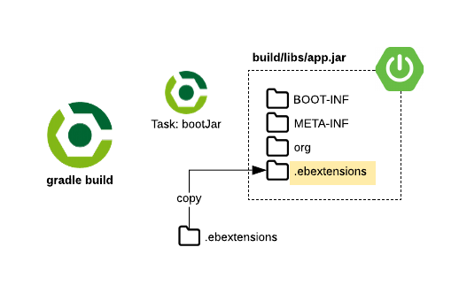
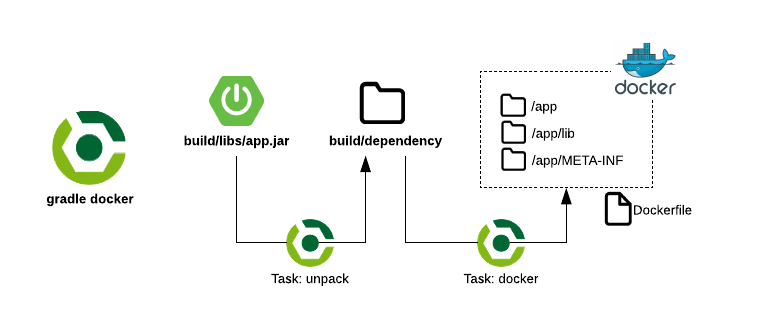
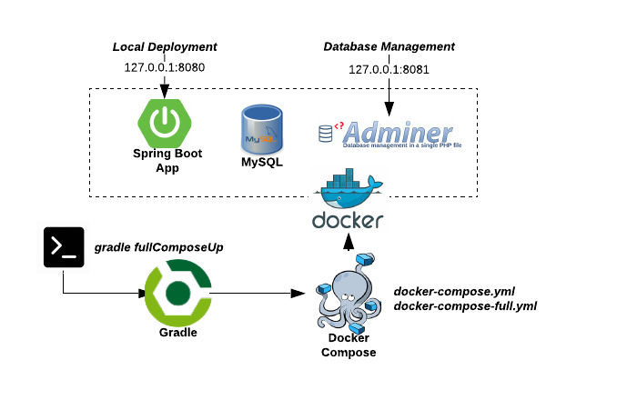
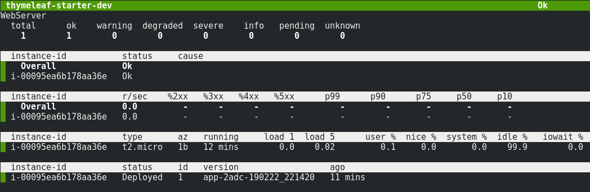

# Spring Boot Thymeleaf Starter

Starter project based on Spring Boot and Thymeleaf.

## Tech Stack

| Component | Tech |
| --- | --- |
| Build & Deploy | [Gradle](https://gradle.org/), [Docker](https://www.docker.com/), [Docker Compose](https://docs.docker.com/compose/), [AWS Elastic Beanstalk](https://aws.amazon.com/elasticbeanstalk/) |
| Languages | [Kotlin](https://kotlinlang.org/), [Java](https://www.java.com/), [HTML](https://www.w3schools.com/html/), [CSS](https://www.w3schools.com/css/), [JavaScript](https://www.javascript.com/) |
| Frameworks | [Spring Boot](http://spring.io/projects/spring-boot), [Thymeleaf](https://www.thymeleaf.org/), [Bootstrap](https://getbootstrap.com/) |
| Databases | [MySQL](https://www.mysql.com/), [H2](http://www.h2database.com/), [Flyway](https://flywaydb.org) |

## File Structure

The overall file structure is as follows:

```text
thymeleaf-starter/
├── .elasticbeanstalk/
│   └── config.yml
├── ebextensions/
│   └── *.config
├── gradle/wrapper/
│   └── gradle.*.[jar|properties]
├── flyway/
│   ├── credentials/
│   |   └── local.pass
│   └── local.conf
├── src/main/
│   ├── kotlin/
│   |   └── com/jahnelgroup/
│   |       └── *.[kt|java]
│   └── resources/
│       ├── db/
│       |   ├── devdata/*.sql
│       |   └── migration/*.sql
│       ├── static/
│       |   └── *.[css|images|js]
│       ├── templates/
│       |   └── *.html
│       └── application.[properties|yml]
├── src/test/
│   └── (testing framework)
├── Dockerfile
├── build.gradle
├── docker-compose.full.yml
├── docker-compose.yml
└── settings.gradle
```

## Getting Started

Gradle is the build and dependency management tool used by this service. Most actions can be accomplished through Gradle tasks described in the sections below. Most of the requirements needed will be provided through Gradle but you'll still need to install Gradle itself. I suggest using [SDKMAN!](https://sdkman.io/install) because it's referenced in the [Spring Boot documentation](https://docs.spring.io/spring-boot/docs/current/reference/html/getting-started-installing-spring-boot.html#getting-started-sdkman-cli-installation) or use any equivalent tool of your choosing.

### SDKMAN!

If you've opted for SDKMAN! after [installing it](https://sdkman.io/install) then proceed with these installations as well.

```bash
$ sdk install gradle
$ sdk install java
$ sdk install kotlin
$ sdk install gradle
```

### Gradle

Gradle commands can be run one at a time like `gradle clean` as well as combined like `gradle clean build`. Here is a cheat sheet for important Gradle tasks.

#### List Tasks

| Command | Description |
| --- | --- |
| gradle tasks | List all tasks |

#### Clean/Test/Build

| Command | Description |
| --- | --- |
| gradle clean build | Deletes build artifacts and runs a fresh build. |
| gradle test  | Run tests. |

#### How does Gradle build the Spring Boot JAR?

If you inspect the [build.gradle](build.gradle) file you'll notice plugins related to Spring. These will effectively run a normal build process but with further processing to make the JAR executable. Read more about this process [Appendix E. The Executable Jar Format](https://docs.spring.io/spring-boot/docs/current/reference/html/executable-jar.html).

The only difference in this starter is the addition of the [.ebextensions](.ebextensions) directory for Elastic Beanstalk support. Review the `bootJar` task definition in [build.gradle](build.gradle) for how this is accomplished.



To start this application from the command line:

```bash
$ java -jar build/libs/app.jar
...
2019-04-25 20:27:58.558  INFO 1 --- [           main] com.jahnelgroup.App                   : Started App in 27.344 seconds (JVM running for 28.325)
```

### Docker

[Docker](https://en.wikipedia.org/wiki/Docker_(software)) is a computer program that performs operating-system-level virtualization, also known as "containerization". It makes the installation and management of software easier to handle. Docker can assist in the local development process by making it easy to start dependencies like your database.

Follow these steps for [installing docker](https://docs.docker.com/install/) and [installing docker-compose](https://docs.docker.com/compose/install/). This application also leverages two Gradle plugin's to assist with working with docker. [palantir/gradle-docker](https://github.com/palantir/gradle-docker) is used to build the image from the [Dockerfile](./Dockerfile) and [avast/gradle-docker-compose-plugin](https://github.com/avast/gradle-docker-compose-plugin) is used to help start/stop the stacks described in [docker-compose.yml](./docker-compose.yml) and other compose files.

| Command | Description |
| --- | --- |
| gradle clean build docker | Clean, fresh build, then build docker image. |
| gradle fullComposeUp | Start everything including the app (must have built the container first) |
| gradle fullComposeDown | ^ Stops the full stack |
| gradle depsComposeUp | Start only the app dependencies |
| gradle depsComposeDown | ^ Stops the dependency stack |

All of these tasks have their origins as pure docker commands but bringing them into the Gradle ecosystem allows for a more uniform experience. Additionally it provides a platform for more interesting task combinations in the future.

#### How does Gradle build the docker container?

This application uses the [palantir/gradle-docker](https://github.com/palantir/gradle-docker) Gradle plugin for building docker images. The library is powerful but we're just using it as a wrapping around invoking the [Dockerfile](Dockerfile). The architecture of this process was taken from the [Spring Boot with Docker](https://spring.io/guides/gs/spring-boot-docker/) guide.

  

#### Docker for Local Development

When you're actively developing an application it's useful to be able to run it from within an IDE. You can launch only the dependencies in docker containers leaving it up to you for how you'd like to launch the app, preferably from something like IntellIJ where it's easy to debug.

Run only the dependencies (i.e., just the database) in docker with `gradle depsComposeUp`.


Then to stop the dependencies stack run `gradle depsComposeDown`.

Sometimes you just want to launch the entire stack locally without an IDE, perhaps a demo or showcase. You can do this with a variation of compose by running `gradle fullComposeUp`.



Then to stop the full stack run `gradle fullComposeDown`.

#### Native Docker Commands

Refer to the [Docker Documentation](https://docs.docker.com/) for a detailed treatment on the available commands. Please note that you should use the Gradle docker plugin commands shown above for building the image.

Show here are a few native common commands that you'll still need.

List your docker images:

```bash
$ docker images
REPOSITORY                                          TAG                 IMAGE ID            CREATED             SIZE
com.jahnelgroup/thymeleaf-starter                   latest              b86ac0cb2daa        25 minutes ago      151MB
```

List your running containers:

```bash
$ docker ps -a
CONTAINER ID        IMAGE                              COMMAND                  CREATED             STATUS              PORTS                               NAMES
0383023e5aea        mysql:8                                    "docker-entrypoint..."   25 minutes ago      Up 25 minutes       0.0.0.0:3306->3306/tcp, 33060/tcp   db
557a8d58bb70        adminer:4                                  "entrypoint.sh doc..."   25 minutes ago      Up 25 minutes       0.0.0.0:8081->8080/tcp              adminer
165f4026652c        com.jahnelgroup/thymeleaf-starter:latest   "/bin/sh -c 'exec ..."   25 minutes ago      Up 25 minutes       0.0.0.0:8080->8080/tcp              thymeleaf-starter
```

Tail the logs of a particular container:

```bash
$ docker logs -f thymeleaf-starter
...
2019-04-25 20:27:58.556  INFO 1 --- [           main] o.s.b.w.embedded.tomcat.TomcatWebServer  : Tomcat started on port(s): 8080 (http) with context path ''
2019-04-25 20:27:58.558  INFO 1 --- [           main] com.jahnelgroup.App                      : Started App in 27.344 seconds (JVM running for 28.325)
```

### Flyway

[Flyway](https://flywaydb.org) is an open-source database migration tool. It strongly favors simplicity and convention over configuration. It is based around just a few basic commands that help you with the iterative development of a database. Being a Spring application it's very natural for us to leverage JPA/Hibernate for data persistence but it is important to note that **Hibernate is not generating the DDL for us and rather we create them manually by hand** and are they located in [src/main/resources/db/migration](./src/main/resources/db/migration). The properties that disable Hibernate DDL generation are located in [src/main/resources/application.yml](./src/main/resources/application.yml).

| Command | Description |
| --- | --- |
| gradle [flywayMigrate](https://flywaydb.org/documentation/gradle/migrate) | Migrates the database |
| gradle [flywayClean](https://flywaydb.org/documentation/gradle/clean) | Drops all objects in the configured schemas |
| gradle [flywayInfo](https://flywaydb.org/documentation/gradle/info) | Prints the details and status information about all the migrations |
| gradle [flywayValidate](https://flywaydb.org/documentation/gradle/validate) | Validates the applied migrations against the ones available on the classpath |
| gradle [flywayBaseline](https://flywaydb.org/documentation/gradle/baseline) | Baselines an existing database, excluding all migrations up to and including baselineVersion |
| gradle [flywayRepair](https://flywaydb.org/documentation/gradle/repair) | Repairs the schema history table |

By default these Flyway commands are pointing to the local instance per the configuration found in `build.gradle`.

```groovy
flyway {
	configFiles = [
		'flyway/local.conf', 'flyway/credentials/local.pass'
	]
}
```

#### Database Seed Data

If you need seed data it can easily be separated out from the Flyway DDL migrations by specifying it as an additional Flyway location. For example you can leverage Flyway callbacks to run the seed data as described in this article [How to create database test data for Spring Boot applications with Flyway DB](https://medium.com/@jonashavers/how-to-create-database-test-data-for-spring-boot-applications-with-flyway-db-294a436db7ee). It's important to note that the seed data must be idempotent, more specifically it should not produce errors if run multiple times. An example of this is to use `insert ignore into` as opposed to `insert into`.

To leverage this simply create more folders under the src/main/resources/db folder. Using Spring Profiles change the list of migrations to reflect the way you want to seed environments differently.

```text
src/main/
└── resources/
    ├── db/
    |   ├── devdata/*.sql
    |   └── migration/*.sql
```

#### Running Flyway against a remote database. 

This application will use an embedded Flyway dependency to automatically migrate your database upon startup. However, sometimes you'll still want to inspect the Flyway status of a database yourself. In order to do this you'll use a Gradle Flyway plugin from the command line.

You'll need two configuration files in place to achieve this - one for the database URL and location of migrations, and the other for the database credentials. **You will not commit the database credentials file to version control because it will be ignored by .gitignore**.

Here is the base structure of the [flyway](./flyway) directory.

```text
thymeleaf-starter/
└── flyway/
    ├── credentials/
    |   ├── .gitignore    // this will ignore your other *.pass files
    |   └── local.pass
    └── local.conf
```

Now let's add the ability to connect to a remote database by adding two additional files.

```text
thymeleaf-starter/
└── flyway/
    ├── credentials/
    |   ├── .gitignore  
    |   ├── aws-dev.pass   // secret credentials
    |   └── local.pass
    ├── aws-dev.conf       // db url and migrations
    └── local.conf
```

Here would be the contents of these files, replace the variables with your own values:

**flyway/aws-dev.conf**
```text
flyway.url=jdbc:mysql://${DB_URL}:${DB_PORT}/${DB_SCHEMA}?useSSL=false
flyway.locations=classpath:db/migration
```
    
**flyway/credentials/dev.pass**
```text
flyway.user=${DB_USER}
flyway.password=${DB_PASS}
```

To run the Gradle Flyway plugin commands against this database pass this argument in:
    
```bash
$ gradle -Dflyway.configFiles=flyway/aws-dev.conf,flyway/credentials/aws-dev.pass flywayInfo
```

**Note:** If you're running this against a remote environment behind a Firewall (i.e., AWS) you'll need to expose the port and whitelist your IP address to have access to it.

### HTTP/REST Testing Tools

Here are a few useful HTTP testing tools:

* [curl](https://curl.haxx.se/docs/manpage.html)
* [HTTPie](https://httpie.org/)
* [Postman](https://www.getpostman.com/)

## Quick Start - Run Locally

Ensure you have Gradle, Java, and Docker installed based on the instructure above. Invoke the `gradle fullComposeUp` command to initiate the entire which includes the application and the database.

```
$ gradle fullComposeUp

> Task :fullComposeUp
adminer uses an image, skipping
db uses an image, skipping
app uses an image, skipping
Creating network "e786c2c2a0474a08129fcf4561ff7928_thymeleaf-starter_full_frontend" with the default driver
Creating network "e786c2c2a0474a08129fcf4561ff7928_thymeleaf-starter_full_backend" with the default driver
Creating thymeleaf-starter ... 
Creating db                ... 
Creating e786c2c2a0474a08129fcf4561ff7928_thymeleaf-starter_full_adminer_1_5beb9ccaa3e6 ... 
Creating thymeleaf-starter                                                              ... done
Creating e786c2c2a0474a08129fcf4561ff7928_thymeleaf-starter_full_adminer_1_5beb9ccaa3e6 ... done
Creating db                                                                             ... done
Will use 172.21.0.1 (network e786c2c2a0474a08129fcf4561ff7928_thymeleaf-starter_full_backend) as host of adminer
Will use 172.21.0.1 (network e786c2c2a0474a08129fcf4561ff7928_thymeleaf-starter_full_backend) as host of app
Will use 172.21.0.1 (network e786c2c2a0474a08129fcf4561ff7928_thymeleaf-starter_full_backend) as host of db
Probing TCP socket on 172.21.0.1:8081 of service 'adminer_1'
TCP socket on 172.21.0.1:8081 of service 'adminer_1' is ready
Probing TCP socket on 172.21.0.1:8080 of service 'thymeleaf-starter'
Waiting for TCP socket on 172.21.0.1:8080 of service 'thymeleaf-starter' (Connection refused (Connection refused))
Waiting for TCP socket on 172.21.0.1:8080 of service 'thymeleaf-starter' (Connection refused (Connection refused))
Waiting for TCP socket on 172.21.0.1:8080 of service 'thymeleaf-starter' (Connection refused (Connection refused))
TCP socket on 172.21.0.1:8080 of service 'thymeleaf-starter' is ready
Probing TCP socket on 172.21.0.1:3306 of service 'db'
TCP socket on 172.21.0.1:3306 of service 'db' is ready

Deprecated Gradle features were used in this build, making it incompatible with Gradle 6.0.
Use '--warning-mode all' to show the individual deprecation warnings.
See https://docs.gradle.org/5.4/userguide/command_line_interface.html#sec:command_line_warnings

BUILD SUCCESSFUL in 50s
12 actionable tasks: 9 executed, 3 up-to-date

```

Verify that the docker image was generated: 

```bash
$ docker images 
REPOSITORY                                          TAG                 IMAGE ID            CREATED              SIZE
com.jahnelgroup/thymeleaf-starter                   latest              b18d953e2ff5        About a minute ago   151MB
```

Verify that the docker containers are running:

```bash
$ docker ps -a
CONTAINER ID        IMAGE                              COMMAND                  CREATED             STATUS              PORTS                               NAMES
0383023e5aea        mysql:8                                    "docker-entrypoint..."   25 minutes ago      Up 25 minutes       0.0.0.0:3306->3306/tcp, 33060/tcp   db
557a8d58bb70        adminer:4                                  "entrypoint.sh doc..."   25 minutes ago      Up 25 minutes       0.0.0.0:8081->8080/tcp              adminer
165f4026652c        com.jahnelgroup/thymeleaf-starter:latest   "/bin/sh -c 'exec ..."   25 minutes ago      Up 25 minutes       0.0.0.0:8080->8080/tcp              thymeleaf-starter
```

Connect the MySQL database and verify that the schema and tables were created _(root/rootpassword)_:

```bash
$ mysql -uroot -p -h127.0.0.1
Enter password: 
Welcome to the MySQL monitor.  Commands end with ; or \g.
Your MySQL connection id is 19
Server version: 8.0.14 MySQL Community Server - GPL

Copyright (c) 2000, 2017, Oracle and/or its affiliates. All rights reserved.

Oracle is a registered trademark of Oracle Corporation and/or its
affiliates. Other names may be trademarks of their respective
owners.

Type 'help;' or '\h' for help. Type '\c' to clear the current input statement.

mysql> show databases;
+--------------------+
| Database           |
+--------------------+
| information_schema |
| jg_starter         |
| mysql              |
| performance_schema |
| sys                |
+--------------------+
5 rows in set (0.00 sec)

mysql> use jg_starter;
Reading table information for completion of table and column names
You can turn off this feature to get a quicker startup with -A

Database changed
mysql> show tables;
+------------------------+
| Tables_in_jg_starter   |
+------------------------+
| authorities            |
| flyway_schema_history  |
| task_lists             |
| tasks                  |
| user_group_authorities |
| user_group_members     |
| user_groups            |
| users                  |
+------------------------+
8 rows in set (0.00 sec)
```

Navigate to http://localhost:8080 and login with _steven / pass_.

## AWS Elastic Beanstalk

[AWS Elastic Beanstalk](https://aws.amazon.com/elasticbeanstalk/) is an easy-to-use service for deploying and scaling web applications and services developed with various technologies like Java and Docker.

### AWS/EB Command Line Setup

The [EB CLI](https://docs.aws.amazon.com/elasticbeanstalk/latest/dg/eb-cli3.html) is a command line interface for Elastic Beanstalk that provides interactive commands that simplify creating, updating and monitoring environments from a local repository. Use the EB CLI as part of your everyday development and testing cycle as an alternative to the AWS Management Console.

To use AWS Elastic Beanstalk you must have:

* An aws account with an *aws_access_key_id* and *aws_access_key_id*
* Your account must be privileged enough to use the Elastic Beanstalk service
* You must have installed and configured the [AWS CLI](https://docs.aws.amazon.com/cli/latest/userguide/cli-chap-install.html)
* You must have installed and configured the [AWS Elastic Beanstalk CLI](https://docs.aws.amazon.com/elasticbeanstalk/latest/dg/eb-cli3.html) 

If you're using multiple AWS accounts it's helpful to manage them with [named profiles](https://docs.aws.amazon.com/cli/latest/userguide/cli-configure-profiles.html). 

**~/.aws/credentials**

```bash
[jahnelgroup]
aws_access_key_id=YOUR_KEY
aws_secret_access_key=YOUR_SECRET
```

**~/.aws/config**

```bash
[profile jahnelgroup]
region = us-east-1
output = json
role_arn = arn:aws:iam::<your_account_id>:role/<your_role>
source_profile = jahnelgroup
```

Validate that you're configured correctly by checking your identity with the named profile:

```bash
$ aws sts get-caller-identity --profile jahnelgroup
{
    "Account": "<your_account_id>",
    "UserId": "<your_user_id>",
    "Arn": "<your_arn>"
}
```

Type `eb` to make sure it's installed:

```bash
$ eb
usage: eb (sub-commands ...) [options ...] {arguments ...}
...
```

### AWS/EB Configuration Files (ebextensions)

We can use [ebextensions](https://docs.aws.amazon.com/elasticbeanstalk/latest/dg/ebextensions-optionsettings.html) to advise Elasitc Beanstalk on how to create an environment. You can have an arbitrary number of config files, here we've broken them up base on resource type and one for the environment variables.

```text
thymeleaf-starter/
├── .elasticbeanstalk/
│   └── config.yml
├── ebextensions/
    ├── db-instance-options.config
    ├── ec2-instance-options.config
    └── env.config
```

### Creating an AWS/EB Environment

Make sure that you're using the named profile of **--profile jahnelgroup** or whatever you decided to call it. Read about the [eb create](https://docs.aws.amazon.com/elasticbeanstalk/latest/dg/eb3-create.html) to become familiar with it's options.

Make sure your application is built with the latest with `gradle clean build`.

```bash
$ gradle clean build
$ eb create --database
Enter Environment Name
(default is thymeleaf-starter-dev): 
Enter DNS CNAME prefix
(default is thymeleaf-starter-dev): 

Enter an RDS DB username (default is "ebroot"): 
Enter an RDS DB master password: 
Retype password to confirm: 
2019-02-22 21:14:33    INFO    createEnvironment is starting.
2019-02-22 21:14:34    INFO    Using elasticbeanstalk-us-east-1-12321471834 as Amazon S3 storage bucket for environment data.
2019-02-22 21:14:59    INFO    Created security group named: awseb-e-fa2fszffed-stack-AWSEBSecurityGroup-13R271AAHRC7J
2019-02-22 21:15:15    INFO    Created EIP: 3.208.109.212
2019-02-22 21:15:15    INFO    Creating RDS database named: bb2czfhgfe6e1pzu. This may take a few minutes.
 -- Events -- (safe to Ctrl+C)
```

> Note that by databases created via Elastic Beanstalk will be permanently tied to this environment. If you delete the environment then the database will be destroyed. Also note that AWS will automatically inject your new database information (URL, DB name and credentials) for you which will be picked up by Spring with [application-beanstalk.yml](src/main/resources/application-beanstalk.yml)

You can launch the application from the terminal with:
 
```bash
$ eb open
```

### List AWS/EB Environments and switching between them

List available environments:

```bash
$ eb list
* thymeleaf-starter-dev
thymeleaf-starter-prod
```

Switch between them:

```bash
$ eb use thymeleaf-starter-prod
```

### Redeploy new version to an existing AWS/EB Environment

Make sure your application is built with the latest with `gradle clean build`.

Make sure you're using the correct Elastic Beanstalk environment with `eb list` then redeploy:

```bash
$ eb deploy
```

### Delete an AWS/EB Environment

```bash
$ eb terminate
The environment "thymeleaf-starter-dev" and all associated instances will be terminated.
To confirm, type the environment name: thymeleaf-starter-dev
2019-02-22 21:27:36    INFO    terminateEnvironment is starting.
2019-02-22 21:27:53    INFO    Waiting for EC2 instances to terminate. This may take a few minutes.
2019-02-22 21:31:26    INFO    Deleted EIP: 3.208.109.212
```

### Getting quick health statistics of an AWS/EB Environment

You can easily get quick health statics about your application by running `eb health`

 

## Spring Boot Dev Tools

[Spring Boot Dev Tools](https://docs.spring.io/spring-boot/docs/current/reference/html/using-boot-devtools.html) includes an additional set of tools that can make the application development experience a little more pleasant.

### Live Reload within IntelliJ

IDE's are fantastic but introduce complexity when it comes to watching file changes. As such Spring Boot Dev Tools can't easily automatically detect if files have changed within IntelliJ. 

If you want changes to take effect then triggering a build within IntelliJ will cause Spring Boot to reload:

* \[Build\] then \[Rebuild Project]
* Or use short cut `Ctrl + F9`  

#### Fully Automatic

If you really want every change to trigger a reload then follow additional steps described in [this article](https://www.romaniancoder.com/spring-boot-live-reload-with-intellij/).

* \[Ctrl + Shift + A] then select Registry
* Enable "compiler.automake.allow.when.app.running" then close
* \[File Menu] then \[Settings]
* Expand \[Build, Execution, Deployment] then select Compiler
* Enable "Build project automatically" then Apply then Ok
* Restart IntelliJ