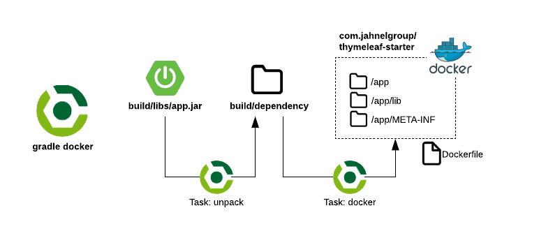

# Spring Boot Thymeleaf Starter

Jahnel Group starter for Spring Boot and Thymeleaf.  

## Tech Stack

| Component | Tech |
| --- | --- |
| Build & Deploy | [Gradle](https://gradle.org/), [Docker](https://www.docker.com/), [Docker Compose](https://docs.docker.com/compose/), [AWS Elastic Beanstalk](https://aws.amazon.com/elasticbeanstalk/) |
| Languages | [Kotlin](https://kotlinlang.org/), [Java](https://www.java.com/), [HTML](https://www.w3schools.com/html/), [CSS](https://www.w3schools.com/css/), [JavaScript](https://www.javascript.com/) |
| Frameworks | [Spring Boot](http://spring.io/projects/spring-boot), [Thymeleaf](https://www.thymeleaf.org/), [Bootstrap](https://getbootstrap.com/) |
| Databases | [MySQL](https://www.mysql.com/), [H2](http://www.h2database.com/), [Flyway](https://flywaydb.org) |

## File Structure 

The overall file structure is as follows:

```text
thymeleaf-starter/
├── .elasticbeanstalk/
│   └── config.yml
├── ebextensions/
│   └── *.config
├── gradle/wrapper/
│   └── gradle.*.[jar|properties]
├── src/main/
│   ├── kotlin/
│   |   └── com/jahnelgroup/
│   |       └── *.[kt|java]
│   └── resources/
│       ├── db/
│       |   ├── devdata/*.sql
│       |   └── migration/*.sql
│       ├── static/
│       |   └── *.[css|images|js]
│       ├── templates/
│       |   └── *.html
│       └── application.[properties|yml]
├── src/test/
│   └── (testing framework)
├── Dockerfile
├── build.gradle
├── docker-compose.full.yml
├── docker-compose.yml
└── settings.gradle
```

## Quickstart

Gradle is the build and dependency management tool used by this starter. Most actions can be accomplished through Gradle tasks described in the sections below.

### Active Development w/ IntelliJ

When you're actively developing an application it's useful to be able to run it from within an IDE. This starter allows you to launch only the dependencies in docker containers leaving it up to you for how you'd like to launch the app, preferably from something like IntellIJ where it's easy to debug. 


Run only the dependencies in docker with:

```bash
$ gradle depsComposeUp
```

Then to stop the dependencies stack:

```bash
$ gradle depsComposeDown
```

### Running the entire stack locally with Docker

Sometimes you just want to launch the entire stack locally without an IDE, perhaps a demo or showcase. This starter allows you to with a variation of composeUp.


```bash
$ gradle fullComposeUp
```

Then to stop the full stack:

```bash
$ gradle fullComposeDown
```

### Deploying to AWS with Elastic Beanstalk

AWS Elastic Beanstalk is an easy-to-use service for deploying and scaling web applications and services. Its basic concept is deploying *Applications* into one or more *Environments*. It's a great way conduct rapid development during the early days of a project.  

#### Setup

To use AWS Elastic Beanstalk you must have:

* An aws account with an *aws_access_key_id* and *aws_access_key_id*
* Your account must be privileged enough to use the Elastic Beanstalk service
* You must have installed and configured the [AWS CLI](https://docs.aws.amazon.com/cli/latest/userguide/cli-chap-install.html)
* You must have installed and configured the [AWS Elastic Beanstalk CLI](https://docs.aws.amazon.com/elasticbeanstalk/latest/dg/eb-cli3.html) 

Validate that you're configured correctly by checking your identity:

```bash
$ aws sts get-caller-identity
{
    "Account": "<your_account_id>", 
    "UserId": "<your_user_id>", 
    "Arn": "<your_arn>"
}
```

Type `eb` to make sure it's installed:

```bash
$ eb
usage: eb (sub-commands ...) [options ...] {arguments ...}
...
```

#### Create Environment

Make sure your application is built with the latest with `gradle clean build`.

Create a single instance + database by following the prompts to describe your environment. 

```bash
$ eb create --single --database
Enter Environment Name
(default is thymeleaf-starter-dev): 
Enter DNS CNAME prefix
(default is thymeleaf-starter-dev): 

Enter an RDS DB username (default is "ebroot"): 
Enter an RDS DB master password: 
Retype password to confirm: 
2019-02-22 21:14:33    INFO    createEnvironment is starting.
2019-02-22 21:14:34    INFO    Using elasticbeanstalk-us-east-1-12321471834 as Amazon S3 storage bucket for environment data.
2019-02-22 21:14:59    INFO    Created security group named: awseb-e-fa2fszffed-stack-AWSEBSecurityGroup-13R271AAHRC7J
2019-02-22 21:15:15    INFO    Created EIP: 3.208.109.212
2019-02-22 21:15:15    INFO    Creating RDS database named: bb2czfhgfe6e1pzu. This may take a few minutes.
 -- Events -- (safe to Ctrl+C)
```

> Note that by databases created via Elastic Beanstalk will be permanently tied to this environment. If you delete the environment then the database will be destroyed. Also note that AWS will automatically inject your new database information (URL, DB name and credentials) for you which will be picked up by Spring with [application-beanstalk.yml](src/main/resources/application-beanstalk.yml)

#### List environments and switch between them

List available environments:

```bash
$ eb list
* thymeleaf-starter-dev
thymeleaf-starter-prod
```

Switch between them:

```bash
$ eb use thymeleaf-starter-prod
```

#### Redeploy new version to an existing environment.

Make sure your application is built with the latest with `gradle clean build`.

Make sure you're using the correct Elastic Beanstalk environment with `eb list` then redeploy:

```bash
$ eb deploy
```

#### Delete an environment

```bash
$ eb terminate
The environment "thymeleaf-starter-dev" and all associated instances will be terminated.
To confirm, type the environment name: thymeleaf-starter-dev
2019-02-22 21:27:36    INFO    terminateEnvironment is starting.
2019-02-22 21:27:53    INFO    Waiting for EC2 instances to terminate. This may take a few minutes.
2019-02-22 21:31:26    INFO    Deleted EIP: 3.208.109.212
```

## Gradle 

### List Tasks

| Command | Description |
| --- | --- |
| gradle tasks | List all tasks |

### Clean/Test/Build

| Command | Description |
| --- | --- |
| gradle clean build | Deletes build artifacts and runs a fresh build. |
| gradle test  | Run tests. |

#### How does Gradle build the Spring Boot JAR?

If you inspect the [build.gradle](build.gradle) file you'll noticed a bunch of plugins related to Spring. These will effectively run a normal build process but with further processing to make them executable. Read more about this process [Appendix E. The Executable Jar Format](https://docs.spring.io/spring-boot/docs/current/reference/html/executable-jar.html). 

The only difference in this starter is the addition of the [.ebextensions](.ebextensions) directory for Elastic Beanstalk support. Review the `bootJar` task definition in [build.gradle](build.gradle) for how this is accomplished. 


### Docker

| Command | Description |
| --- | --- |
| gradle clean build docker | Clean, fresh build, then build docker image. |
| gradle fullComposeUp | Start everything including the app (must have built the container first) |
| gradle fullComposeDown | ^ Stops the full stack |
| gradle depsComposeUp | Start only the app dependencies |
| gradle depsComposeDown | ^ Stops the dependency stack |

#### How does Gradle build the docker container?

TODO.

  

### Flyway

| Command | Description |
| --- | --- |
| gradle [flywayMigrate](https://flywaydb.org/documentation/gradle/migrate) | Migrates the database |
| gradle [flywayClean](https://flywaydb.org/documentation/gradle/clean) | Drops all objects in the configured schemas |
| gradle [flywayInfo](https://flywaydb.org/documentation/gradle/info) | Prints the details and status information about all the migrations |
| gradle [flywayValidate](https://flywaydb.org/documentation/gradle/validate) | Validates the applied migrations against the ones available on the classpath |
| gradle [flywayBaseline](https://flywaydb.org/documentation/gradle/baseline) | Baselines an existing database, excluding all migrations up to and including baselineVersion |
| gradle [flywayRepair](https://flywaydb.org/documentation/gradle/repair) | Repairs the schema history table |

By default these Flyway commands are pointing to a local instance of the starter database per this configuration found in `build.gradle`.

```groovy
flyway {
    url = 'jdbc:mysql://127.0.0.1:3306/jg_starter'
    user = 'root'
	password = 'rootpassword'
}
``` 

## AWS Elastic Beanstalk

TODO: Configure aws cli and eb cli

Commands:

`eb list`
`eb create --single --database`
`eb setenv SPRING_PROFILES_ACTIVE=beanstalk`

https://docs.aws.amazon.com/elasticbeanstalk/latest/dg/environment-configuration-methods-during.html

## Spring Boot Dev Tools

[Spring Boot Dev Tools](https://docs.spring.io/spring-boot/docs/current/reference/html/using-boot-devtools.html) includes an additional set of tools that can make the application development experience a little more pleasant.

### Live Reload within IntelliJ

IDE's are fantastic but introduce complexity when it comes to watching file changes. As such Spring Boot Dev Tools can't easily automatically detect if files have changed within IntelliJ. 

If you want changes to take effect then triggering a build within IntelliJ will cause Spring Boot to reload:

* \[Build\] then \[Rebuild Project]
* Or use short cut `Ctrl + F9`  

#### Fully Automatic

If you really want every change to trigger a reload then follow additional steps described in [this article](https://www.romaniancoder.com/spring-boot-live-reload-with-intellij/).

* \[Ctrl + Shift + A] then select Registry
* Enable "compiler.automake.allow.when.app.running" then close
* \[File Menu] then \[Settings]
* Expand \[Build, Execution, Deployment] then select Compiler
* Enable "Build project automatically" then Apply then Ok
* Restart IntelliJ
